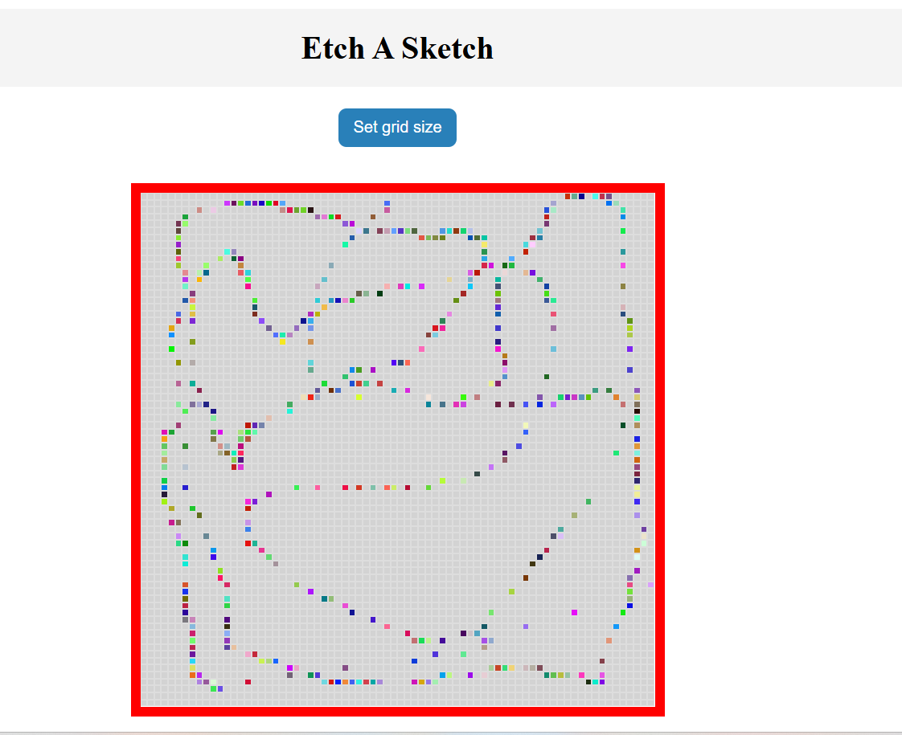

# 🎨 Etch-a-Sketch

A simple web-based drawing application inspired by the classic Etch-a-Sketch toy.

## 📌 Description

This project allows users to draw on a customizable grid using only their mouse. As the cursor hovers over each square, the square changes to a random color, simulating a digital sketching effect.

## 💡 Features

- Customizable grid size (1x1 to 100x100)
- Dynamic color changes on hover
- Fully responsive grid layout inside a fixed container
- Clean and minimal interface

## 🧱 Technologies Used

- HTML
- CSS
- JavaScript (vanilla)

## 📸 Preview



## 🚀 Getting Started

### 1. Clone the repository
```bash
git clone https://github.com/matheusmarqs1/etch-a-sketch.git
````

## 2. Navigate into the folder

```bash
cd etch-a-sketch
```

## 3. Open `index.html` in your browser


---

## 🛠️ How to Use

- Click the **"Set grid size"** button to define how many squares per side you'd like.
- Hover your mouse over the grid to start drawing with random colors.
- Refresh or set a new grid size anytime.

---


## 🧑‍💻 Author

- Matheus Teles  
- GitHub: [@matheusmarqs1](https://github.com/matheusmarqs1)


